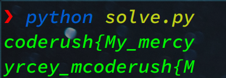
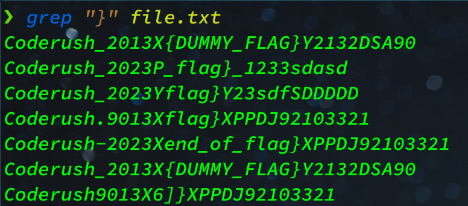

# Problem description

The flag is spread throughout the file. There are lines which are in this format : patternXpattern where X is partial content of the flag. The flag can be constructed by concatenating all such X in the entire file (you dont need to reorder)

[file](file.txt)

# Approach

If we look into the file we can see that the whole flag might be there as there are "{" and "}" characters present.

We can search for "{" in the file but out first instinct should be searching for "coderush{"


We can guess the pattern might be,
Coderush*2023X(.*)X or
Coderush*2023K(.*)K

Now lets write a python script to find out what these regex will give us,

```python
import re

f = open("file.txt", "r")
txt = f.read()

match1 = re.findall(r'Coderush_2023X(.*)X', txt)
match2 = re.findall(r'Coderush_2023K(.*)K', txt)

print("".join(match1))
print("".join(match2))
```

The result is,



So we are getting somewhere with the first pattern, but its not enough

Lets search for "}" now,



Previously we have seen that
"coderush{" is contained inside Coderush_2023X(.\*)X
So we should search for patterns which is a superset of this one

Lets analyze the relevant lines, we will change the pattern in the regex of our python script and see if that gives us the flag

| line                                    | deduction                                                                                     | combined pattern         | result                                              |
| --------------------------------------- | --------------------------------------------------------------------------------------------- | ------------------------ | --------------------------------------------------- |
| Coderush_2013X{DUMMY_FLAG}Y2132DSA90    | ...X(.\*)Y - doesn't match with initial pattern                                               |                          |                                                     |
| Coderush.9013Xflag}XPPDJ92103321        | There is "." instead "\_" and instead of 2023 there are other digits but it can be a superset | Coderush[_.]\d{4}X(.\*)X | coderush{My_mercybraces_allflag}\_7:1               |
| Coderush-2023Xend_of_flag}XPPDJ92103321 | "-" instead of "\_"                                                                           | Coderush[-_]2023X(.\*)X  | end_of_flag}                                        |
| Coderush9013X6]}XPPDJ92103321           | No \_ present, other numbers than 2023                                                        | Coderush\_?\d{4}X(.\*)X  | coderush{My_mercy_embraces_all_things[Quran_7:156]} |

If you look closely in the file, you can see there is a hint about the pattern,
Line 8 contains,

```
8:CoderushUnderscore|not-4n{start_of_flagX2103XSD
```

It is indicating the pattern starts with Coderush and after that there might a "\_" or there might not be
